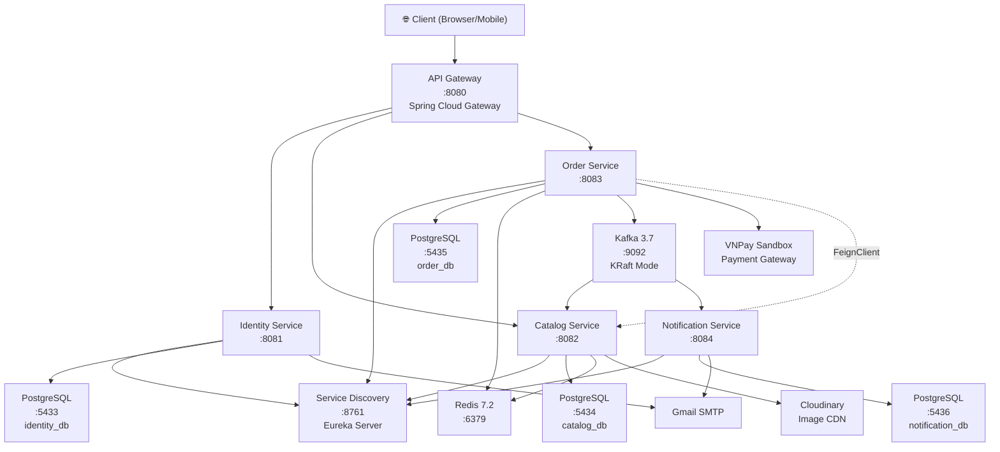
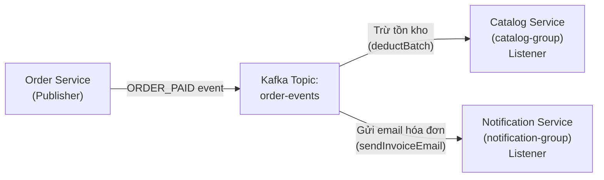
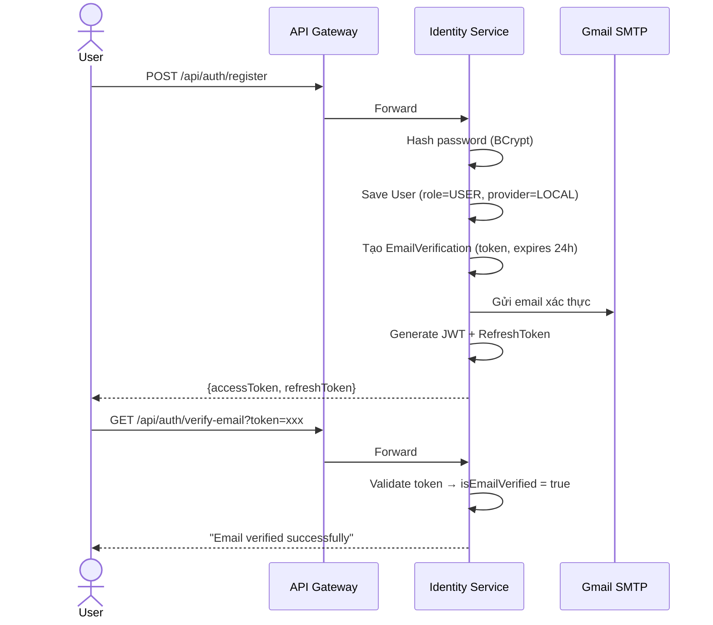
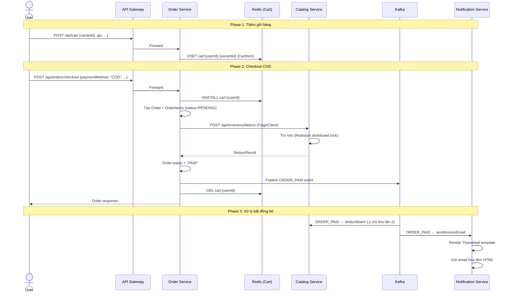
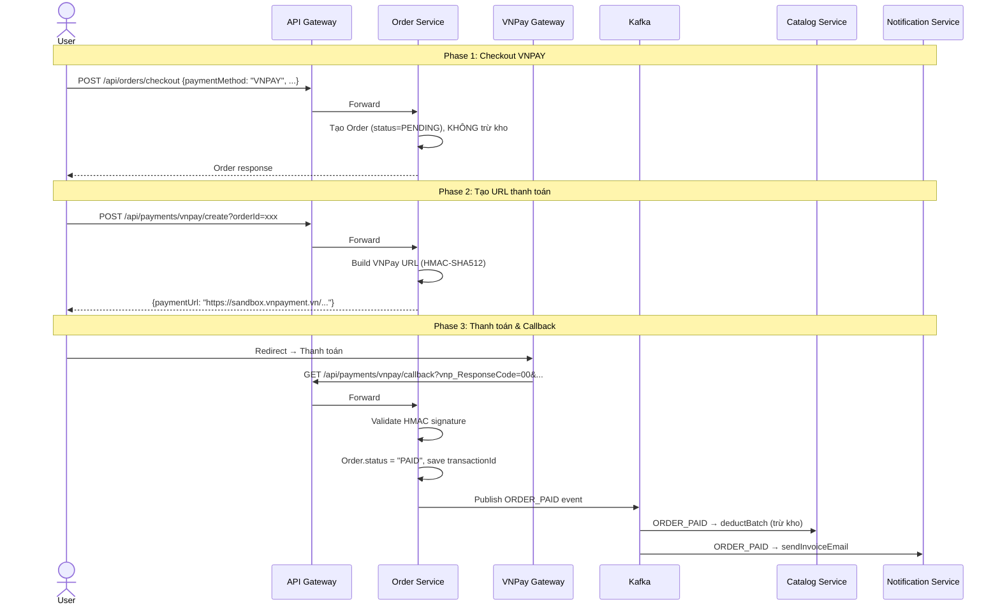
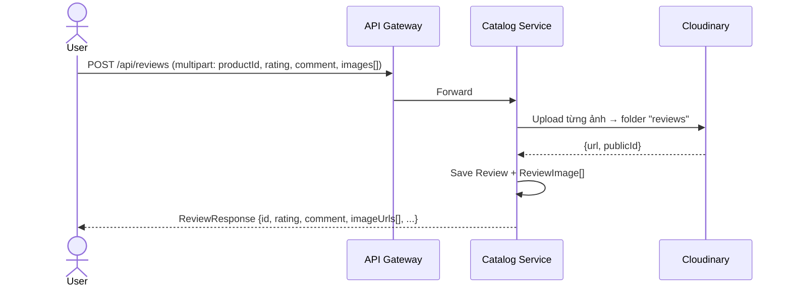
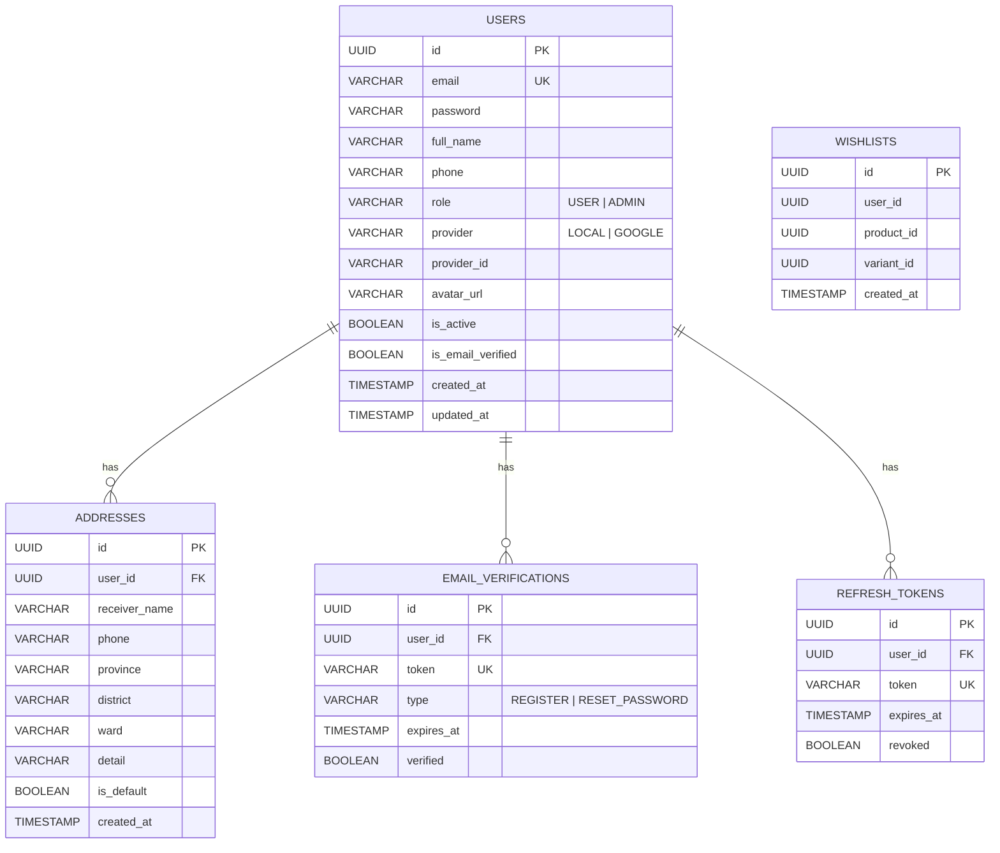
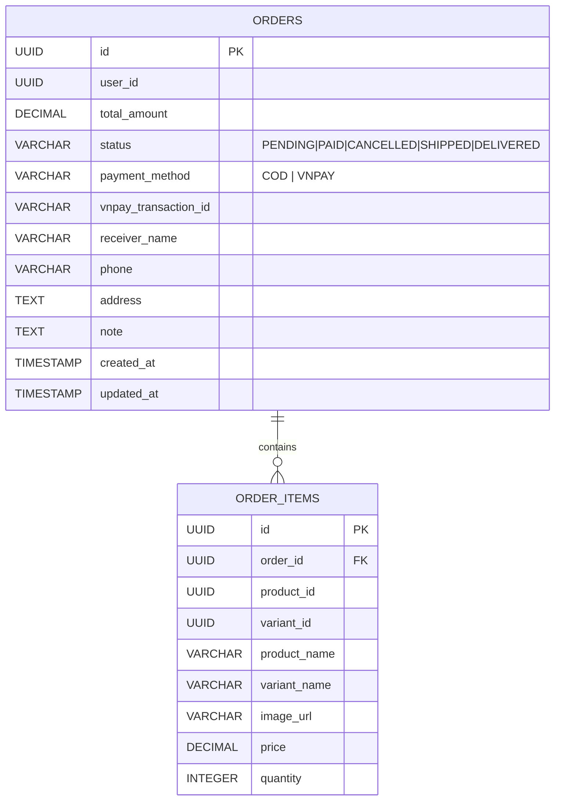

# 🪷 MỘC HƯƠNG SHOP — PROJECT STATUS & ROADMAP

> **Dự án:** aromatics-platform (E-commerce Nhang, Chuỗi Gỗ, Vật Phẩm Thiền, Dầu Thơm)
> **Ngày cập nhật:** 06/10/2026
> **Trạng thái tổng quan:** 🟡 **~75-80% Backend hoàn thiện** — Core business flows đã functional, cần polish & production-ready

---

## 1. 🏗️ TỔNG QUAN KIẾN TRÚC & TECH STACK

### 1.1 Kiến trúc Microservices



### 1.2 Tech Stack Chi Tiết

| Layer | Technology | Version |
|-------|-----------|---------|
| **Runtime** | Java | 21 |
| **Framework** | Spring Boot | 3.4.4 |
| **Cloud** | Spring Cloud | 2024.0.1 |
| **Gateway** | Spring Cloud Gateway (Reactive) | — |
| **Discovery** | Netflix Eureka | — |
| **Database** | PostgreSQL | 15 |
| **Migration** | Flyway | — |
| **Cache** | Redis + Redisson | 7.2 / 3.45.1 |
| **Message Broker** | Apache Kafka (KRaft) | 3.7 |
| **Auth** | JWT (jjwt 0.12.6) + Spring Security | — |
| **Image Storage** | Cloudinary | 1.40.0 |
| **Payment** | VNPay (Sandbox) | v2.1.0 |
| **Email** | Gmail SMTP + Thymeleaf | — |
| **API Docs** | SpringDoc OpenAPI | 2.8.6 |
| **Infra** | Docker Compose | — |
| **ORM** | Spring Data JPA + Hibernate | — |
| **Build** | Maven (Multi-module) | — |

---

## 2. 📡 GIAO TIẾP GIỮA CÁC SERVICE

### 2.1 Service Registry & Routing

```
api-gateway (:8080)
├── /api/auth/**,  /api/users/**          → lb://identity-service  (:8081)
├── /api/products/**, /api/categories/**  → lb://catalog-service   (:8082)
├── /api/inventory/**, /api/reviews/**    → lb://catalog-service   (:8082)
└── /api/cart/**, /api/orders/**          → lb://order-service     (:8083)
    /api/payments/**                      → lb://order-service     (:8083)
```

### 2.2 Giao Tiếp Đồng Bộ (Feign Client)

```
order-service ──[POST /api/inventory/deduct]──▶ catalog-service
```

- **Mục đích:** Khi checkout COD, order-service gọi trực tiếp catalog-service để trừ tồn kho ngay lập tức
- **DTO:** `List<DeductRequest>` → `List<DeductResult>`

### 2.3 Giao Tiếp Bất Đồng Bộ (Kafka)



- **Topic:** `order-events`
- **Event Type:** `ORDER_PAID`
- **Payload:** `orderId, userId, totalAmount, receiverName, phone, address, paymentMethod, items[]`
- **Consumer Groups:** `catalog-group` (trừ kho), `notification-group` (gửi email)

> [!IMPORTANT]
> **Dual Deduction Path Detected:**
> - **COD:** Trừ kho **đồng bộ** qua FeignClient tại thời điểm checkout → rồi publish Kafka event
> - **VNPay:** Sau callback thành công → publish Kafka event → Catalog listener trừ kho **bất đồng bộ**
>
> Điều này có nghĩa: Với đơn COD, kho bị trừ **HAI LẦN** (1 lần Feign + 1 lần Kafka). Đây là bug tiềm ẩn cần fix — xem [Next Steps](#6-next-steps--todo-list).

---

## 3. 🔄 LUỒNG NGHIỆP VỤ CỐT LÕI (Business Flows)

### 3.1 Luồng Đăng Ký & Xác Thực



### 3.2 Luồng Mua Hàng COD (Thanh Toán Khi Nhận Hàng)



### 3.3 Luồng Thanh Toán VNPay



### 3.4 Luồng Review Sản Phẩm (Kèm Hình Ảnh)



---

## 4. 📋 DANH SÁCH TÍNH NĂNG THEO MODULE

### 4.1 Identity Service — Quản Lý Người Dùng

| # | Tính năng | API Endpoint | Trạng thái |
|---|-----------|-------------|-----------|
| 1 | Đăng ký tài khoản | `POST /api/auth/register` | ✅ Done |
| 2 | Đăng nhập | `POST /api/auth/login` | ✅ Done |
| 3 | Refresh Token (Rotation) | `POST /api/auth/refresh` | ✅ Done |
| 4 | Xác thực email | `GET /api/auth/verify-email` | ✅ Done |
| 5 | Xem profile | `GET /api/users/me` | ✅ Done |
| 6 | Cập nhật profile | `PUT /api/users/me` | ✅ Done |
| 7 | CRUD địa chỉ giao hàng | `GET/POST/PUT/DELETE /api/users/me/addresses` | ✅ Done |
| 8 | Đặt địa chỉ mặc định | `PUT /api/users/me/addresses/{id}/default` | ✅ Done |
| 9 | Wishlist (yêu thích) | `GET/POST/DELETE /api/users/me/wishlist` | ✅ Done |
| 10 | Reset password | — | ❌ Entity có (`RESET_PASSWORD` enum) nhưng chưa implement |
| 11 | OAuth Google login | — | ❌ Enum `GOOGLE` có nhưng chưa implement |
| 12 | Admin quản lý users | — | ❌ Chưa có |

### 4.2 Catalog Service — Sản Phẩm & Danh Mục

| # | Tính năng | API Endpoint | Trạng thái |
|---|-----------|-------------|-----------|
| 1 | Danh mục dạng cây (cha-con) | `GET /api/categories` | ✅ Done |
| 2 | Chi tiết danh mục theo slug | `GET /api/categories/{slug}` | ✅ Done |
| 3 | CRUD danh mục (Admin) | `POST/PUT/DELETE /api/categories` | ✅ Done |
| 4 | Danh sách sản phẩm (phân trang, filter, sort) | `GET /api/products` | ✅ Done |
| 5 | Chi tiết sản phẩm theo slug | `GET /api/products/{slug}` | ✅ Done |
| 6 | Tạo sản phẩm + upload ảnh (Admin) | `POST /api/products` | ✅ Done |
| 7 | Cập nhật sản phẩm (Admin) | `PUT /api/products/{id}` | ✅ Done |
| 8 | Xóa sản phẩm (Admin) | `DELETE /api/products/{id}` | ✅ Done |
| 9 | Quản lý ảnh sản phẩm (Admin) | `POST/DELETE /api/products/{id}/images` | ✅ Done |
| 10 | Xem tồn kho theo variant | `GET /api/inventory/{variantId}` | ✅ Done |
| 11 | Cập nhật tồn kho (Admin) | `PUT /api/inventory/{variantId}` | ✅ Done |
| 12 | Trừ kho nội bộ | `POST /api/inventory/deduct` | ✅ Done |
| 13 | Xem review sản phẩm | `GET /api/reviews/product/{productId}` | ✅ Done |
| 14 | Viết review + upload ảnh | `POST /api/reviews` | ✅ Done |
| 15 | Sửa/Xóa review | `PUT/DELETE /api/reviews/{id}` | ✅ Done |
| 16 | Cache sản phẩm (Redis) | — | ✅ Done |
| 17 | Distributed Lock trừ kho (Redisson) | — | ✅ Done |
| 18 | Lắng nghe Kafka trừ kho | `OrderEventListener` | ✅ Done |

### 4.3 Order Service — Đơn Hàng & Thanh Toán

| # | Tính năng | API Endpoint | Trạng thái |
|---|-----------|-------------|-----------|
| 1 | Xem giỏ hàng | `GET /api/cart` | ✅ Done |
| 2 | Thêm vào giỏ hàng | `POST /api/cart` | ✅ Done |
| 3 | Cập nhật số lượng | `PUT /api/cart/{variantId}` | ✅ Done |
| 4 | Xóa khỏi giỏ | `DELETE /api/cart/{variantId}` | ✅ Done |
| 5 | Xóa toàn bộ giỏ | `DELETE /api/cart` | ✅ Done |
| 6 | Checkout (tạo đơn hàng) | `POST /api/orders/checkout` | ✅ Done |
| 7 | Xem danh sách đơn hàng | `GET /api/orders` | ✅ Done |
| 8 | Xem chi tiết đơn hàng | `GET /api/orders/{id}` | ✅ Done |
| 9 | Hủy đơn hàng (PENDING) | `PUT /api/orders/{id}/cancel` | ✅ Done |
| 10 | Tạo URL thanh toán VNPay | `POST /api/payments/vnpay/create` | ✅ Done |
| 11 | VNPay callback xử lý | `GET /api/payments/vnpay/callback` | ✅ Done |
| 12 | Publish Kafka event | `OrderEventPublisher` | ✅ Done |
| 13 | Admin quản lý đơn hàng | — | ❌ Chưa có |
| 14 | Cập nhật trạng thái (SHIPPED/DELIVERED) | — | ❌ Chưa có |

### 4.4 Notification Service — Thông Báo

| # | Tính năng | API Endpoint | Trạng thái |
|---|-----------|-------------|-----------|
| 1 | Lắng nghe Kafka ORDER_PAID | `OrderEventListener` | ✅ Done |
| 2 | Gửi email hóa đơn HTML | `EmailService` | ⚠️ Partial — email hardcode `customer@example.com` |
| 3 | Template email hóa đơn | `invoice-email.html` | ✅ Done |
| 4 | Bảng `notification_logs` | Schema có | ❌ Chưa implement lưu log |

---

## 5. 🔍 CHUẨN ĐOÁN TIẾN ĐỘ — BẠN ĐÃ LÀM TỚI ĐÂU?

### Dấu hiệu phân tích

| Bằng chứng | Kết luận |
|------------|----------|
| Migration cuối cùng: `V4__update_review_for_images.sql` | Tính năng **cuối cùng** bạn code là: **Review kèm upload ảnh lên Cloudinary** |
| `ReviewServiceImpl` có đầy đủ CRUD + upload ảnh | Review Image feature **đã hoàn thiện** |
| `PaymentController` + `VNPayUtil` đã có logic đầy đủ | VNPay integration **đã code xong**, nhưng cần test thực tế |
| `EmailService.sendInvoiceEmail()` có dòng `helper.setTo("customer@example.com")` | Email hóa đơn **chưa hoàn thiện** — thiếu email thật của user |
| Bảng `notification_logs` có schema nhưng không có Entity/Service tương ứng | Notification logging **chưa implement** |
| Không có Dockerfile, CI/CD, README | **Chưa chuẩn bị** cho deployment |
| Chỉ có default Spring Boot test class | **Chưa viết test** nghiệp vụ |
| Enum `RESET_PASSWORD`, `GOOGLE` tồn tại nhưng không có code xử lý | Bạn **đã plan** nhưng chưa implement |
| `OrderController.checkout()` trả về entity `Order` trực tiếp | **Chưa có DTO response** cho Order API, có thể leak sensitive data |

### 📊 Tiến Độ Tổng Thể

```
┌─────────────────────────────────────────────────────────────┐
│  IDENTITY SERVICE    ████████████████████░░░░  ~85%         │
│  CATALOG SERVICE     █████████████████████░░░  ~90%         │
│  ORDER SERVICE       ████████████████████░░░░  ~80%         │
│  NOTIFICATION SVC    ████████████░░░░░░░░░░░░  ~50%         │
│  API GATEWAY         █████████████████████████  ~95%         │
│  SERVICE DISCOVERY   █████████████████████████  ~95%         │
│  INFRA (Docker)      ████████████████░░░░░░░░░  ~65%         │
│  TESTING             ██░░░░░░░░░░░░░░░░░░░░░░  ~5%          │
│  CI/CD               ░░░░░░░░░░░░░░░░░░░░░░░░  ~0%          │
│─────────────────────────────────────────────────────────────│
│  OVERALL BACKEND     █████████████████░░░░░░░░  ~75%         │
└─────────────────────────────────────────────────────────────┘
```

### 🎯 Milestone Đạt Được

1. ✅ **M1 — Foundation:** Kiến trúc microservices, Service Discovery, API Gateway, DB schema
2. ✅ **M2 — Identity:** Auth hoàn chỉnh (Register/Login/JWT/RefreshToken/EmailVerify)
3. ✅ **M3 — Catalog Core:** Product CRUD + Category + Variants + Cloudinary image upload
4. ✅ **M4 — Inventory:** Tồn kho + Distributed Lock + Cache Redis
5. ✅ **M5 — Cart & Checkout:** Giỏ hàng Redis + Order flow + FeignClient + Kafka event pipeline
6. ✅ **M6 — Payment:** VNPay sandbox integration
7. ✅ **M7 — Notification:** Email hóa đơn HTML template + Kafka consumer
8. ✅ **M8 — Review:** Review + Rating + Image upload (feature cuối cùng)

### 🔴 Vấn Đề Cần Xử Lý Ngay

> [!CAUTION]
> **Bug trừ kho 2 lần với đơn COD:**
> Trong `OrderServiceImpl.checkout()`, khi `paymentMethod = "COD"`:
> 1. Gọi `catalogFeignClient.deductInventory()` — trừ kho lần 1 ✅
> 2. Publish `ORDER_PAID` event → Catalog `OrderEventListener.handleOrderEvent()` → `inventoryService.deductBatch()` — trừ kho lần 2 ❌
>
> **Fix:** Hoặc bỏ Feign deduct cho COD (chỉ dùng Kafka), hoặc bỏ deduct trong Kafka listener khi đã deduct qua Feign.

> [!WARNING]
> **Email hóa đơn hardcode recipient:**
> `EmailService.sendInvoiceEmail()` đang set `helper.setTo("customer@example.com")`.
> Event `ORDER_PAID` có `userId` nhưng không có `email`. Cần bổ sung `email` vào Kafka event payload hoặc gọi Identity Service để lấy email.

---

## 6. 🚀 NEXT STEPS — TODO LIST

### Priority 1: Bug Fixes (Làm ngay) 🔴

#### Task 1.1: Fix Dual Inventory Deduction Bug
- **File:** [`OrderServiceImpl.java`](file:///c:/Users/Minh Triet/Desktop/Moc_Huong_Shop_Personal_Project/aromatics-platform/order-service/src/main/java/com/minhtriet/se3979/orderservice/service/impl/OrderServiceImpl.java)
- **Giải pháp đề xuất:** Bỏ `catalogFeignClient.deductInventory()` trong checkout COD. Thống nhất dùng Kafka cho cả COD và VNPay. Luồng mới:
  ```
  Checkout → Save Order (PENDING) → [COD: set PAID] → Publish Kafka → Kafka trừ kho
  ```
- **Lý do:** Event-driven architecture nên nhất quán. Feign chỉ dùng để **validate** stock có đủ hay không (check availability), không phải deduct.

#### Task 1.2: Fix Email Recipient trong Notification Service
- **File:** [`OrderEventPublisher.java`](file:///c:/Users/Minh Triet/Desktop/Moc_Huong_Shop_Personal_Project/aromatics-platform/order-service/src/main/java/com/minhtriet/se3979/orderservice/kafka/OrderEventPublisher.java) — thêm `userEmail` vào event payload
- **File:** [`EmailService.java`](file:///c:/Users/Minh Triet/Desktop/Moc_Huong_Shop_Personal_Project/aromatics-platform/notification-service/src/main/java/com/minhtriet/se3979/notificationservice/service/EmailService.java) — dùng email từ event thay vì hardcode
- **Cách lấy email:** Order Service gọi Identity Service qua FeignClient để lấy email trước khi publish event, hoặc lưu email trong Order entity

### Priority 2: Hoàn Thiện Business Logic 🟡

#### Task 2.1: Implement Notification Logging
- **Mục tiêu:** Bảng `notification_logs` đã có schema nhưng chưa có Entity/Repository/Service
- **Việc cần làm:**
  - Tạo `NotificationLog` entity, `NotificationLogRepository`
  - Trong `EmailService`, lưu log mỗi lần gửi email (status: SENT/FAILED, errorMessage)

#### Task 2.2: Thêm Admin Order Management
- **Mục tiêu:** Admin có thể xem tất cả đơn, cập nhật trạng thái SHIPPED/DELIVERED
- **Việc cần làm:**
  - Thêm endpoints: `GET /api/orders/admin/all`, `PUT /api/orders/admin/{id}/status`
  - Phát Kafka event `ORDER_SHIPPED`, `ORDER_DELIVERED` để gửi email thông báo cho customer
  - Hoàn kho khi Admin cancel đơn

#### Task 2.3: Implement Reset Password Flow
- **Mục tiêu:** Enum `RESET_PASSWORD` đã có, cần code logic
- **Việc cần làm:**
  - `POST /api/auth/forgot-password` — gửi email reset
  - `POST /api/auth/reset-password` — đổi mật khẩu với token

### Priority 3: Production Readiness 🟢

#### Task 3.1: Thêm Order DTO Response
- **Vấn đề:** `OrderController` trả về entity `Order` trực tiếp → có thể leak internal data
- **Việc cần làm:** Tạo `OrderResponse`, `OrderDetailResponse` DTO

#### Task 3.2: Dockerfile + docker-compose.services.yml
- **Mục tiêu:** Dockerize từng service
- **Việc cần làm:**
  - Tạo `Dockerfile` cho mỗi service (multi-stage build)
  - Tạo `docker-compose.services.yml` để chạy toàn bộ hệ thống
  - Cấu hình Spring profiles cho Docker environment

#### Task 3.3: Integration Test cho Business Flows
- **Ưu tiên test:**
  - Luồng Checkout COD end-to-end
  - VNPay callback + signature validation
  - Kafka event pipeline (Order → Catalog trừ kho → Notification gửi email)
  - JWT auth + authorization

---

## 7. 📐 ER DIAGRAMS

### Identity Service



### Catalog Service

```mermaid
erDiagram
    CATEGORIES {
        UUID id PK
        VARCHAR name
        VARCHAR slug UK
        VARCHAR description
        VARCHAR image_url
        UUID parent_id FK
        BOOLEAN is_active
        TIMESTAMP created_at
        TIMESTAMP updated_at
    }

    PRODUCTS {
        UUID id PK
        VARCHAR name
        VARCHAR slug UK
        TEXT description
        UUID category_id FK
        VARCHAR origin "Xuất xứ"
        VARCHAR material "Chất liệu"
        VARCHAR usage_guide "Hướng dẫn"
        BOOLEAN is_active
        TIMESTAMP created_at
        TIMESTAMP updated_at
    }

    PRODUCT_VARIANTS {
        UUID id PK
        UUID product_id FK
        VARCHAR variant_name "VD: Hộp 40 cây"
        VARCHAR sku UK
        DECIMAL price
    }

    PRODUCT_IMAGES {
        UUID id PK
        UUID product_id FK
        VARCHAR image_url
        VARCHAR cloudinary_id
        BOOLEAN is_primary
        INTEGER sort_order
    }

    INVENTORIES {
        UUID id PK
        UUID variant_id FK UK
        INTEGER quantity
        INTEGER reserved_quantity
        TIMESTAMP created_at
        TIMESTAMP updated_at
    }

    REVIEWS {
        UUID id PK
        UUID product_id
        UUID user_id
        INTEGER rating "1-5"
        TEXT comment
        TIMESTAMP created_at
        TIMESTAMP updated_at
    }

    REVIEW_IMAGES {
        UUID id PK
        UUID review_id FK
        VARCHAR image_url
        VARCHAR cloudinary_id
    }

    CATEGORIES ||--o{ CATEGORIES : "parent-child"
    CATEGORIES ||--o{ PRODUCTS : contains
    PRODUCTS ||--o{ PRODUCT_VARIANTS : has
    PRODUCTS ||--o{ PRODUCT_IMAGES : has
    PRODUCTS ||--o{ REVIEWS : has
    PRODUCT_VARIANTS ||--|| INVENTORIES : tracks
    REVIEWS ||--o{ REVIEW_IMAGES : has
```

### Order Service



---

## 8. 📁 CẤU TRÚC THƯ MỤC

```
aromatics-platform/
├── pom.xml                              (Parent POM - Java 21, Spring Boot 3.4.4)
├── docker-compose.infra.yml             (PostgreSQL x4, Redis, Kafka)
│
├── service-discovery/                   (:8761 - Eureka Server)
├── api-gateway/                         (:8080 - Spring Cloud Gateway)
│
├── identity-service/                    (:8081)
│   └── src/main/java/.../
│       ├── controller/                  AuthController, UserController
│       ├── entity/                      User, Address, Wishlist, EmailVerification, RefreshToken
│       ├── enums/                       Provider, Role, VerificationType
│       ├── security/                    JwtAuthFilter, JwtUtil, CustomUserDetails, SecurityConfig
│       ├── service/impl/               AuthServiceImpl, UserServiceImpl, TokenServiceImpl
│       ├── repository/                  UserRepo, AddressRepo, WishlistRepo, ...
│       └── exception/                   AppException, GlobalExceptionHandler
│
├── catalog-service/                     (:8082)
│   └── src/main/java/.../
│       ├── controller/                  ProductController, CategoryController, InventoryController, ReviewController
│       ├── entity/                      Product, ProductVariant, ProductImage, Category, Inventory, Review, ReviewImage
│       ├── config/                      CloudinaryConfig, RedissonConfig, OpenApiConfig, SecurityConfig
│       ├── service/                     ProductService, CategoryService, InventoryService, ReviewService, CloudinaryService, ProductCacheService
│       ├── kafka/                       OrderEventListener
│       └── repository/                  ProductRepo, CategoryRepo, InventoryRepo, ReviewRepo, ...
│
├── order-service/                       (:8083)
│   └── src/main/java/.../
│       ├── controller/                  CartController, OrderController
│       ├── entity/                      Order, OrderItem
│       ├── redis/                       CartItem
│       ├── feign/                       CatalogFeignClient
│       ├── kafka/                       OrderEventPublisher
│       ├── vnpay/                       PaymentController, VNPayUtil
│       ├── service/impl/               OrderServiceImpl, CartServiceImpl
│       └── security/                    JwtAuthFilter, JwtUtil, SecurityConfig
│
└── notification-service/                (:8084)
    └── src/main/java/.../
        ├── kafka/                       OrderEventListener
        ├── service/                     EmailService
        └── resources/templates/         invoice-email.html
```

---

> *Tài liệu này được tạo tự động dựa trên phân tích source code thực tế của dự án aromatics-platform.*
